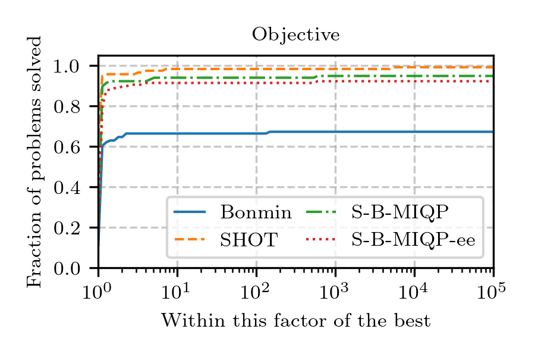
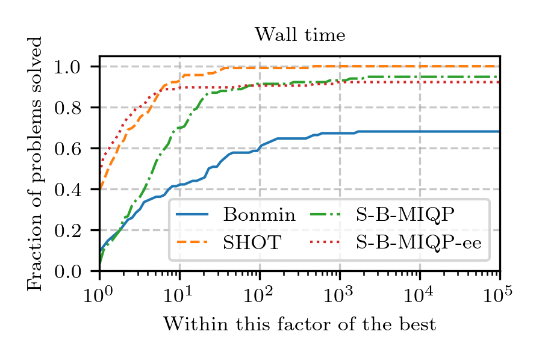
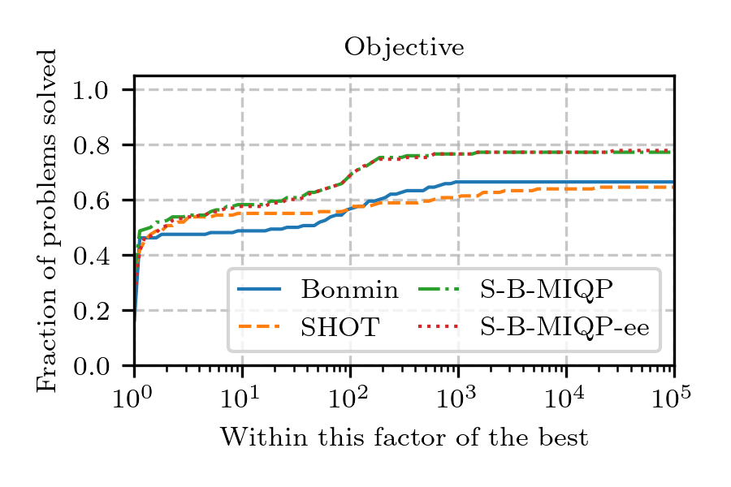
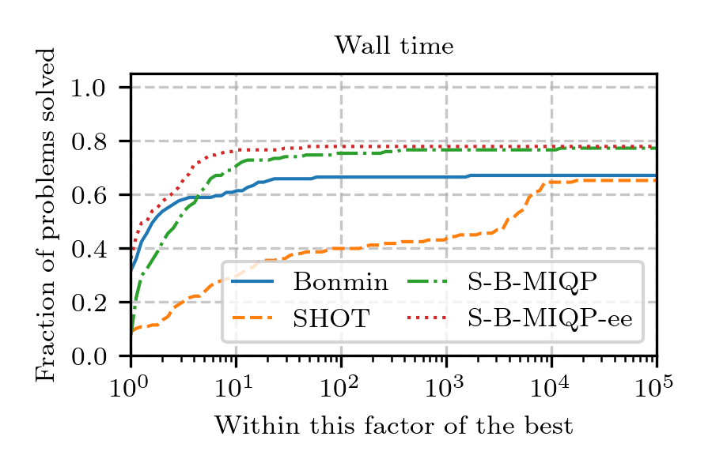

# CAMINO-Benchmark
To reproduce the results of the benchmark in our paper, download the nl files here: https://www.minlplib.org/minlplib_nl.zip \
See the list of problem instances at the bottom.

## Quickly reproduce the results in the preprint

Set up a new Python environment (**Python version >= 3.9.1**), clone the repository and install it.
```
git clone git@github.com:minlp-toolbox/CAMINO-benchmark.git
cd CAMINO-benchmark
python -m venv env
source env/bin/activate
pip install .
```
**To use the SHOT solver, you must install it separately**, follow [installation instructions](https://shotsolver.dev/shot/about-shot/compiling).\
`pip install .` will install the `caminopy` package containing the [CAMINO](https://github.com/minlp-toolbox/CAMINO) solvers.
CAMINO relies on CasADi to interface NLP and MIP solvers such as Ipopt, Highs, Gurobi. **To make your Gurobi installation visible to CasADi** follow this [instructions](https://github.com/casadi/casadi/wiki/FAQ:-how-to-get-third-party-solvers-to-work%3F).

We provide a shell script to easily run and store the results showed in our preprint, checkout `run_benchmark.sh`. Another script called `combine_files.sh` merges the results into a single csv file, then a python script called `create_plot.py` creates the figures with the performance profiles.
In your shell execute the following
```
./benchmark/run_benchmark.sh <path_to_dir_with_minlplib_nl_files> <path_to_save_results>
./benchmark/combine_files.sh <path_to_save_results>
python benchmark/create_plot.py <path_to_save_results>/cvx.csv cvx
python benchmark/create_plot.py <path_to_save_results>/noncvx.csv noncvx
```
**Replace** `<...>` with your own path, e.g., `<path_to_dir_with_minlplib_nl_files>` -> `/Users/myself/minlplib`

### Results
On our machine (with Intel(R) Xeon(R) W-2225 CPU @ 4.10GHz and 16GB of memory), we have obtained the following performance profiles.
Computations run on a single thread, with time limit set to 5 minutes.\
These results correspond to the one found in the folder `results/05_14_results`.
#### Convex instances
<p float="left">
  
  
</p>

#### Nonconvex instances
<p float="left">
  
  
</p>

## Problem instances

**Convex problems:**
batch.nl batch0812.nl batchdes.nl clay0203hfsg.nl clay0204hfsg.nl clay0205hfsg.nl clay0303hfsg.nl clay0304hfsg.nl clay0305hfsg.nl cvxnonsep_normcon20.nl cvxnonsep_normcon30.nl cvxnonsep_normcon40.nl cvxnonsep_nsig20.nl cvxnonsep_nsig20r.nl cvxnonsep_nsig30.nl cvxnonsep_nsig30r.nl cvxnonsep_nsig40.nl cvxnonsep_nsig40r.nl cvxnonsep_pcon20.nl cvxnonsep_pcon20r.nl enpro48pb.nl enpro56pb.nl ex1223.nl ex1223b.nl fac1.nl fac2.nl flay02h.nl flay02m.nl flay03h.nl flay03m.nl flay04h.nl flay04m.nl flay05h.nl flay05m.nl flay06h.nl flay06m.nl fo7.nl fo7_2.nl fo7_ar25_1.nl fo7_ar2_1.nl fo7_ar3_1.nl fo7_ar4_1.nl fo7_ar5_1.nl fo8.nl fo8_ar25_1.nl fo8_ar2_1.nl fo8_ar3_1.nl fo8_ar4_1.nl fo8_ar5_1.nl fo9.nl fo9_ar25_1.nl fo9_ar2_1.nl fo9_ar3_1.nl fo9_ar4_1.nl fo9_ar5_1.nl gear2.nl gear3.nl jit1.nl m3.nl m6.nl m7.nl m7_ar25_1.nl m7_ar2_1.nl m7_ar3_1.nl m7_ar4_1.nl m7_ar5_1.nl no7_ar25_1.nl no7_ar2_1.nl no7_ar3_1.nl no7_ar4_1.nl no7_ar5_1.nl nvs20.nl o7.nl o7_2.nl o7_ar25_1.nl o7_ar2_1.nl o7_ar3_1.nl o7_ar4_1.nl o7_ar5_1.nl o8_ar4_1.nl o9_ar4_1.nl p_ball_10b_5p_2d_h.nl p_ball_10b_5p_3d_h.nl p_ball_10b_5p_4d_h.nl p_ball_10b_7p_3d_h.nl p_ball_15b_5p_2d_h.nl p_ball_20b_5p_2d_h.nl p_ball_20b_5p_3d_h.nl p_ball_30b_5p_2d_h.nl portfol_buyin.nl portfol_card.nl portfol_roundlot.nl prob10.nl ravempb.nl sssd08-04.nl sssd12-05.nl sssd15-04.nl sssd15-06.nl sssd15-08.nl sssd16-07.nl sssd18-06.nl sssd18-08.nl sssd20-04.nl sssd20-08.nl sssd22-08.nl sssd25-04.nl sssd25-08.nl st_e14.nl stockcycle.nl synthes1.nl synthes2.nl synthes3.nl tls2.nl tls4.nl tls5.nl tls6.nl

**Nonconvex problems:**
4stufen.nl autocorr_bern20-05.nl autocorr_bern20-10.nl autocorr_bern20-15.nl autocorr_bern25-06.nl autocorr_bern25-13.nl autocorr_bern25-19.nl autocorr_bern25-25.nl autocorr_bern30-04.nl autocorr_bern30-08.nl autocorr_bern30-15.nl autocorr_bern30-23.nl autocorr_bern30-30.nl autocorr_bern35-04.nl autocorr_bern35-09.nl autocorr_bern35-18.nl autocorr_bern35-26.nl autocorr_bern35-35fix.nl autocorr_bern40-05.nl autocorr_bern40-10.nl autocorr_bern40-20.nl autocorr_bern40-30.nl autocorr_bern40-40.nl autocorr_bern45-05.nl autocorr_bern45-11.nl autocorr_bern45-23.nl autocorr_bern45-34.nl autocorr_bern45-45.nl autocorr_bern50-06.nl autocorr_bern50-13.nl autocorr_bern50-25.nl autocorr_bern55-06.nl autocorr_bern55-14.nl autocorr_bern60-08.nl autocorr_bern60-15.nl batch0812_nc.nl batch_nc.nl beuster.nl casctanks.nl contvar.nl csched1.nl csched1a.nl csched2.nl csched2a.nl eg_int_s.nl eniplac.nl ex1221.nl ex1222.nl ex1224.nl ex1225.nl ex1226.nl ex1233.nl ex1243.nl ex1244.nl ex1252.nl ex1252a.nl ex3pb.nl feedtray.nl gasnet.nl gastrans.nl gastrans040.nl gear2.nl gear3.nl gear4.nl ghg_1veh.nl ghg_2veh.nl ghg_3veh.nl gkocis.nl heatexch_gen1.nl heatexch_gen2.nl heatexch_gen3.nl heatexch_spec1.nl heatexch_spec2.nl heatexch_spec3.nl hybriddynamic_var.nl johnall.nl kport20.nl kport40.nl nvs01.nl nvs05.nl nvs08.nl nvs20.nl nvs21.nl nvs22.nl oaer.nl ortez.nl parallel.nl pooling_epa1.nl pooling_epa2.nl prob10.nl procsel.nl sfacloc1_2_90.nl sfacloc1_2_95.nl sfacloc1_3_90.nl sfacloc1_3_95.nl sfacloc1_4_90.nl sfacloc1_4_95.nl sfacloc2_2_90.nl sfacloc2_2_95.nl sfacloc2_3_90.nl sfacloc2_3_95.nl sfacloc2_4_90.nl sfacloc2_4_95.nl spring.nl st_e15.nl st_e29.nl st_e32.nl st_e35.nl st_e36.nl st_e38.nl st_e40.nl supplychainp1_020306.nl supplychainr1_020306.nl supplychainr1_030510.nl synheat.nl tanksize.nl transswitch0009p.nl transswitch0009r.nl transswitch0014p.nl transswitch0014r.nl transswitch0030p.nl transswitch0030r.nl transswitch0039p.nl transswitch0039r.nl tspn05.nl tspn08.nl tspn10.nl tspn12.nl tspn15.nl wager.nl wastepaper3.nl wastepaper4.nl wastepaper5.nl wastepaper6.nl water4.nl waternd1.nl waternd2.nl waterno2_01.nl waterno2_02.nl waterno2_03.nl watertreatnd_conc.nl watertreatnd_flow.nl waterx.nl waterz.nl windfac.nl

---
## Longer instructions
### Solve problems with `SHOT`
Install SHOT by following the [instructions](https://shotsolver.dev/shot/about-shot/compiling).

With the script `run_shot.py` it is possible to solve the problems using SHOT.
Usage:

```
python run_shot.py <problem type 'cvx', 'noncvx'> <root_folder_minlp> <results_folder>
```

### Solve problems with `CAMINO`
Install the CAMINO package
```
pip install caminopy
```

Run using the batch runner
```
python -m camino batch <solver> <output-folder> <list-of-nl-files>
```


### Processing the results
#### Creating a csv file
With the script `combine_files.sh` one can quickly generate the summary of the results by merging the results using `bonmin`, `s-b-miqp`, `s-b-miqp-early-exit`, `shot`.\
`combine_file.sh` runs the script `to_csv.py`, `read_shot.py`, and `join_data.py`.\
Check the shell script or edit to adapt it to your code and saved data.

#### Create figures
Lunch the script `create_plot.py` for creating the performance profiles.
Usage:
```
python create_plot.py <data_file.csv> <key: 'cvx', 'noncvx'>
```

---
## TODO WIM

Create 4 tables -> Add * when calculation time reaches limit
Cleanup tables and explain columns
