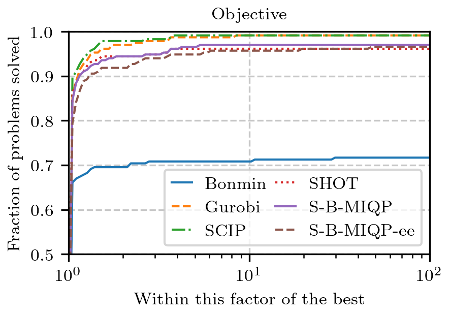
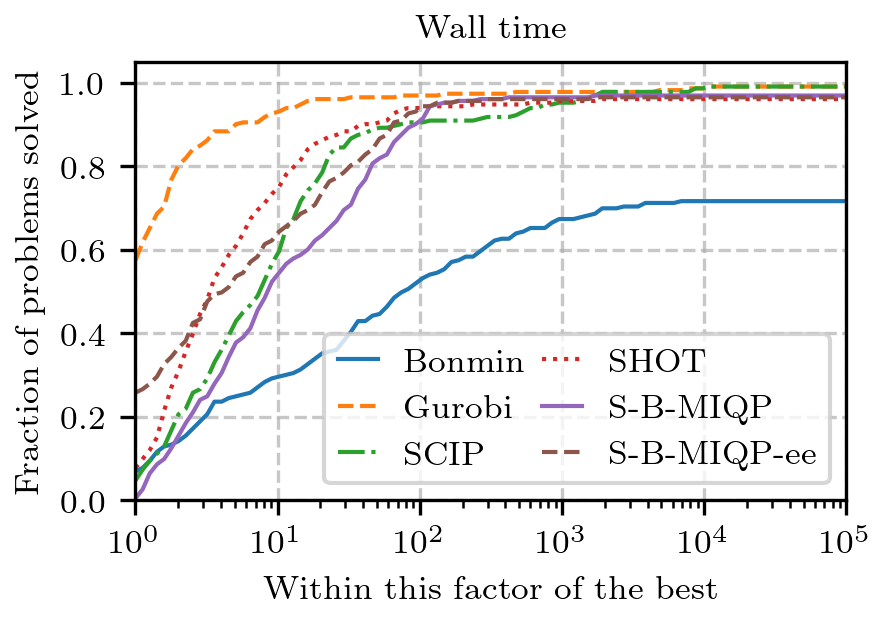
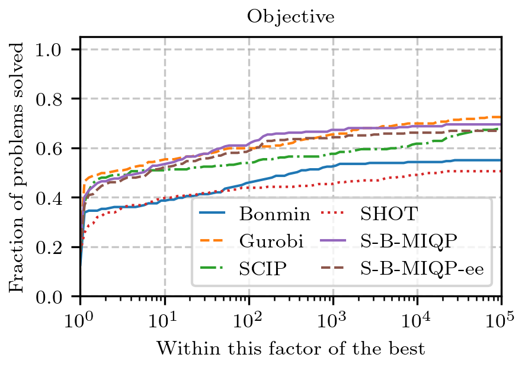
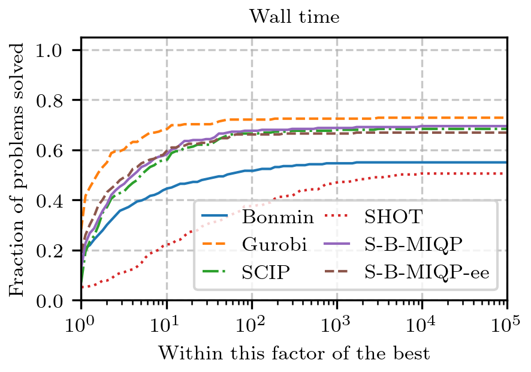

# CAMINO-Benchmark
To reproduce the results of the benchmark in our paper, download the nl files here: https://www.minlplib.org/minlplib_nl.zip \
See the list of problem instances at the bottom.

## Quickly reproduce the results in the preprint

Set up a new Python environment (**Python version >= 3.9.1**), clone the repository and install it.
```
git clone git@github.com:minlp-toolbox/CAMINO-benchmark.git
cd CAMINO-benchmark
python -m venv env
source env/bin/activate
pip install .
```
**To use the SHOT solver, you must install it separately**, follow [installation instructions](https://shotsolver.dev/shot/about-shot/compiling).\
`pip install .` will install the `caminopy` package containing the [CAMINO](https://github.com/minlp-toolbox/CAMINO) solvers.
CAMINO relies on CasADi to interface NLP and MIP solvers such as Ipopt, Highs, Gurobi. **To make your Gurobi installation visible to CasADi** follow this [instructions](https://github.com/casadi/casadi/wiki/FAQ:-how-to-get-third-party-solvers-to-work%3F).


We provide a shell script to easily run and store the results showed in our preprint, checkout `run_benchmark.sh`.


**SCIP and Gurobi (for MINLPs)** are called via AMPLpy.\
We provide a shell script `run_benchmark_ampl.sh` to execute the benchmark with these solvers.
To use AMPLpy install it via PyPi using the same Python environment
```
python -m pip install amplpy --upgrade
# Install solver modules -- SCIP and Gurobi
python -m amplpy.modules install scip gurobi
```
For using Gurobi, you need a license and you might need to specify it via `python -m amplpy.modules activate <license-uuid>`


Finally, the scipt `combine_files.sh` merges the results into a single csv file, then a python script called `create_plot.py` creates the figures with the performance profiles.
In your shell execute the following
```
./benchmark/run_benchmark.sh compare <path_to_dir_with_minlplib_nl_files> <path_to_save_results>
./benchmark/combine_files.sh compare <path_to_save_results>
python benchmark/create_plot.py <path_to_save_results>/cvx.csv cvx <solve_time> compare
python benchmark/create_plot.py <path_to_save_results>/noncvx.csv noncvx <solve_time> compare
```
**Replace** `<path_*>` with your own paths, e.g., `<path_to_dir_with_minlplib_nl_files>` -> `/Users/myself/minlplib`\
**Replace** `<solve_time>` either with `total_time` or `solve_time`. `solve_time` considers only the time spent into the subsolvers, neglecting the Python overhead.\

**Note.** The field `compare` is to execute the comparison among solvers. If you one to reproduce the sensitivity analysis for te hyperparameters `alpha` and `rho` of S-B-MIQP, then replace compare with `alpha` or `rho`.


### Results
On our machine (with Intel(R) Xeon(R) W-2225 CPU @ 4.10GHz and 32GB of memory), we have obtained the following performance profiles.
Computations run on a single thread, with time limit set to 5 minutes.\
These results correspond to the one found in the folder `results/26_03_10_results`.\
Note that for nonconvex MINLPs, SCIP and Gurobi have a time limited to the time taken by S-B-MIQP on the same problem. In a sense, we are treating every algorithm as a primal heuristic.
#### Convex instances
<p float="left">
  
  
</p>

#### Nonconvex instances
<p float="left">
  
  
</p>

## Problem instances

List of selected **convex MINLPs** available as csv in `benchmark/convex_set_full.csv` \
List of selected **nonconvex MINLPs** available as csv in `benchmark/nonconvex_set_full.csv`

Selection follows the criteria in `benchmark/get_minlp_instances.py`, the file `benchmark/minlplib_instancedata.csv` corresponds to the list of problems in MINLPLib on March 12th 2026, cf. https://www.minlplib.org/instancedata.csv


---
## Longer instructions
### Solve problems with `SHOT`
Install SHOT by following the [instructions](https://shotsolver.dev/shot/about-shot/compiling).

With the script `run_shot.py` it is possible to solve the problems using SHOT.
Usage:

```
python run_shot.py <problem type 'cvx', 'noncvx'> <root_folder_minlp> <results_folder>
```

### Solve problems with `CAMINO`
Install the CAMINO package
```
pip install caminopy
```

Run using the batch runner
```
python -m camino batch <solver> <output-folder> <list-of-nl-files>
```


### Processing the results
#### Creating a csv file
With the script `combine_files.sh` one can quickly generate the summary of the results by merging the results using `bonmin`, `s-b-miqp`, `s-b-miqp-early-exit`, `shot`.\
`combine_file.sh` runs the script `to_csv.py`, `read_shot.py`, and `join_data.py`.\
Check the shell script or edit to adapt it to your code and saved data.

#### Create figures
Lunch the script `create_plot.py` for creating the performance profiles.
Usage:
```
python create_plot.py <data_file.csv> <key: 'cvx', 'noncvx'>
```
